# Galeria: as 11 planificações do cubo

> Trilha Mirim 2 (4º e 5º anos) · Caminho 3 · Complemento do Bloco 5 (Planificação do cubo). Material de consulta, para usar ao lado do capítulo `Cap_Planificacao_Cubo.md`.

O capítulo do Bloco $5$ já mostrou que nem todo molde de seis quadrados fecha um cubo. Esta galeria responde à pergunta seguinte: **quantos moldes diferentes fecham?** A resposta é $11$. Não $10$, não $12$: exatamente $11$ formatos diferentes de seis quadrados grudados dobram, sem sobrar nem faltar papel, num cubo fechado.

***De onde vem esse número***

Existem $35$ jeitos diferentes de grudar seis quadrados uns nos outros, sempre encostando lado com lado (esses formatos de seis quadrados se chamam ***hexaminós***). Dois formatos que são apenas giros ou reflexos um do outro contam como o mesmo formato. Desses $35$, a maioria não fecha um cubo: ao dobrar, alguma face fica faltando ou duas faces ficam encavaladas uma em cima da outra. Só $11$ desses $35$ formatos fecham certinho, com as seis faces ocupando um lugar só, cada uma.

**Guarde.** Todo molde que fecha um cubo tem que ter exatamente seis quadrados, mas ter seis quadrados não é garantia nenhuma de que ele fecha. Dos $35$ formatos possíveis, $24$ não fecham. É por isso que vale a pena conhecer os $11$ que funcionam.

***As quatro famílias das 11 planificações***

As $11$ planificações não são $11$ formatos soltos e sem relação. Elas se agrupam em quatro famílias, de acordo com o formato da fileira mais comprida de quadrados grudados em linha reta.

- **Família $1$-$4$-$1$ (seis moldes).** Uma fileira reta de quatro quadrados, com mais um quadrado grudado de um lado da fileira e outro grudado do outro lado. Os dois quadrados extras podem ficar em posições diferentes ao longo da fileira de quatro, e cada posição diferente conta como uma planificação nova. É a família mais numerosa, com seis moldes ao todo, entre eles o formato de cruz, o mais fácil de reconhecer.
- **Família $2$-$3$-$1$ (três moldes).** Uma fileira reta de três quadrados, com um bloco de dois quadrados grudado numa ponta e mais um quadrado sozinho grudado em algum lugar ao longo da fileira de três.
- **Família $3$-$3$ (um molde).** Duas fileiras retas de três quadrados cada, uma do lado da outra, mas deslocadas, tocando-se por um único quadrado em comum. Não é um retângulo de duas linhas por três colunas: um retângulo assim não fecha, ele encavala faces ao dobrar.
- **Família $2$-$2$-$2$ (um molde).** Três blocos de dois quadrados, em escada, cada bloco deslocado um quadrado para o lado do anterior. É a única planificação em que a fileira reta mais comprida tem só dois quadrados.

$$6 + 3 + 1 + 1 = 11$$

***As 11 planificações, uma por uma***

Cada um dos moldes abaixo, recortado e dobrado nas linhas entre os quadrados, fecha um cubo sem sobrar nem faltar face. Repare que vários deles parecem bem diferentes da cruz que costuma aparecer nos livros, mas todos funcionam do mesmo jeito.

**Família $1$-$4$-$1$**

| | | |
|---|---|---|
| 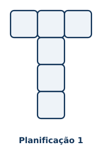 | 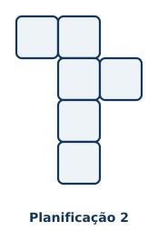 | 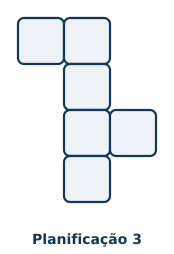 |
| 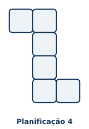 | 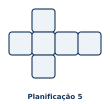 | 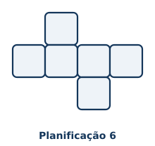 |

**Família $2$-$3$-$1$**

| | | |
|---|---|---|
| 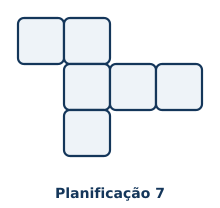 | 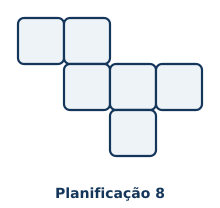 | 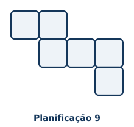 |

**Família $3$-$3$**

| |
|---|
| 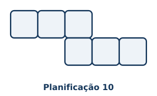 |

**Família $2$-$2$-$2$**

| |
|---|
| 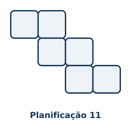 |

**Guarde.** Não existe uma única "planificação certa" do cubo. As $11$ são igualmente válidas: qualquer uma delas, dobrada com cuidado nas linhas entre os quadrados, fecha um cubo perfeito. O que muda de uma para outra é só a posição dos seis quadrados no papel, nunca o resultado final depois de dobrado.

***Ideia para atividade em sala***

Distribua para a turma alguns moldes de seis quadrados desenhados em papel quadriculado, misturando planificações desta galeria com formatos que não fecham (como o retângulo $2\times 3$ ou a fileira reta de seis quadrados, ambos do capítulo do Bloco $5$). Peça que cada aluno marque, antes de recortar, quais moldes acha que vão fechar, e só depois recorte e dobre para conferir. Depois, compare os moldes que fecharam com as $11$ planificações desta página: eles devem ser sempre um giro ou um reflexo de alguma das $11$.

---

***Ilustrações***

| Arquivo | O que mostra |
|---|---|
| `planif11_01.svg` a `planif11_06.svg` | As seis planificações da família $1$-$4$-$1$ (fileira reta de quatro quadrados, com um quadrado extra de cada lado, em posições diferentes) |
| `planif11_07.svg` a `planif11_09.svg` | As três planificações da família $2$-$3$-$1$ (fileira reta de três quadrados, bloco de dois numa ponta, um quadrado extra em posições diferentes) |
| `planif11_10.svg` | A planificação da família $3$-$3$ (duas fileiras de três quadrados, deslocadas, tocando-se por um quadrado) |
| `planif11_11.svg` | A planificação da família $2$-$2$-$2$ (três blocos de dois quadrados, em escada) |
